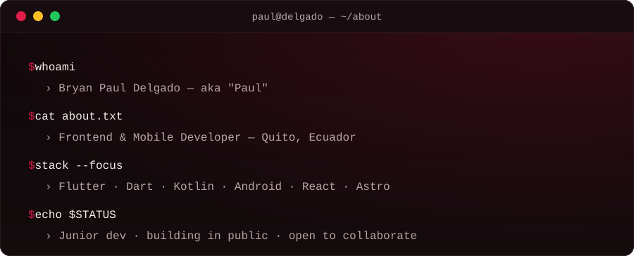
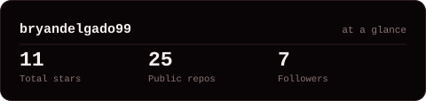
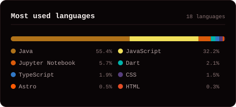

<!-- VENTANA DE PRESENTACIÓN — edit the text in assets/window-dark.svg and assets/window-light.svg -->
<picture>
  <source media="(prefers-color-scheme: dark)"  srcset="assets/window-dark.svg">
  <source media="(prefers-color-scheme: light)" srcset="assets/window-light.svg">
  
</picture>

 

<!-- TAGLINE ANIMADO -->

 

<!-- CONTACTO -->
&nbsp;&nbsp;
&nbsp;&nbsp;
&nbsp;&nbsp;

  

---

## Hey, I'm Paul

Nice to meet you, coder! I'm **Bryan Paul Delgado**, a passionate **Junior Developer** from Quito, Ecuador 🇪🇨, focused on **mobile development** — aiming to create, innovate and refine my skills with every project I ship.

- 📱 **Mobile first:** building apps with Flutter, Dart, Kotlin and Android.
- 🌐 **Also on the web:** React, Vue, Astro and Tailwind for the frontend.
- 🌱 **Currently:** learning in public, shipping small projects and improving my craft.
- 🤝 **Open to:** collaboration, junior roles and open-source contributions.
- 💬 **Talk to me about:** mobile UI, Flutter, or frontend in general — I'm all ears.
- 🔗 **Portfolio:** [pauldelgado.pages.dev](https://pauldelgado.pages.dev)

 

## my stack

 

### environments &amp; design

&nbsp;&nbsp;

&nbsp;&nbsp;

---

## numbers don't lie

<!-- Self-hosted SVGs, regenerated by .github/workflows/cards.yml — no
     github-readme-stats dependency, so a 503 upstream can't blank this out. -->
<picture>
  <source media="(prefers-color-scheme: dark)"  srcset="assets/card-stats-dark.svg">
  <source media="(prefers-color-scheme: light)" srcset="assets/card-stats-light.svg">
  
</picture>

 

<picture>
  <source media="(prefers-color-scheme: dark)"  srcset="assets/card-langs-dark.svg">
  <source media="(prefers-color-scheme: light)" srcset="assets/card-langs-light.svg">
  
</picture>

---

` building in public · @bryandelgado99 `

